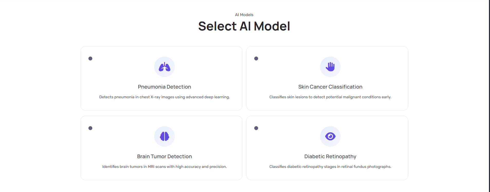

# 🏥 MediAIn - Medical AI Diagnosis Platform

<div align="center">
  
  
  [](https://python.org)
  [](https://flask.palletsprojects.com/)
  [](https://tensorflow.org)
  [](LICENSE)
  
  **Revolutionary AI-powered medical diagnosis platform using state-of-the-art deep learning models**
</div>

---

## 📋 Overview

MediAIn is an advanced medical artificial intelligence platform that leverages cutting-edge deep learning models to assist healthcare professionals in medical diagnosis. Our platform currently supports diagnosis for four critical medical conditions across different specialties, achieving remarkably high accuracy rates.

<div align="center">
  
</div>

> **🚧 Current Status**: This project is currently in beta version and runs locally. The platform is under active development for production deployment.

## 🎯 Key Features

- **Multi-Specialty AI Diagnosis**: Support for Brain, Pulmonary, Ophthalmology, and Dermatology
- **High-Accuracy Models**: All models achieve 95%+ accuracy rates
- **Real-time Predictions**: Instant diagnosis results with confidence scores
- **Gradient-CAM Visualization**: Visual explanation of model decisions
- **Modern Web Interface**: Responsive and user-friendly design
- **RESTful API**: Easy integration with existing healthcare systems

## 🧠 AI Models & Capabilities

<div align="center">
  
</div>

### 🔬 Model Performance Overview

| Model | Architecture | Medical Specialty | Disease Detection | Accuracy |
|-------|-------------|------------------|-------------------|----------|
| **EfficientNet-B1** | CNN | Neurology | Brain Tumor Detection | **99.8%** |
| **ResNet-50** | CNN | Pulmonology | Pneumonia Detection | **99.5%** |
| **ResNet-50** | CNN | Dermatology | Skin Cancer Detection | **97.2%** |
| **EfficientNet-B4** | CNN | Ophthalmology | Diabetic Retinopathy | **95.4%** |

### 🏥 Medical Applications

#### 🧠 **Brain Tumor Detection**
- **Model**: EfficientNet-B1 (224×224 input)
- **Capability**: Binary classification (Tumor/Healthy)
- **Accuracy**: 99.8%
- **Use Case**: Early detection of brain tumors from MRI scans

#### 🫁 **Pneumonia Detection** 
- **Model**: ResNet-50 (224×224 input)
- **Capability**: Binary classification (Pneumonia/Normal)
- **Accuracy**: 99.5%
- **Use Case**: Rapid pneumonia diagnosis from chest X-rays

#### 🩺 **Skin Cancer Detection**
- **Model**: ResNet-50 (224×224 input) 
- **Capability**: Binary classification (Malignant/Benign)
- **Accuracy**: 97.2%
- **Use Case**: Early skin cancer screening from dermoscopic images

#### 👁️ **Diabetic Retinopathy Detection**
- **Model**: EfficientNet-B4 (380×380 input)
- **Capability**: Multi-class classification (5 severity levels)
- **Accuracy**: 95.4%
- **Classes**: Healthy, Mild DR, Moderate DR, Severe DR, Proliferative DR

## 🚀 Getting Started

### Prerequisites

- Python 3.8 or higher
- pip package manager
- At least 8GB RAM (recommended for model loading)

### Installation

1. **Clone the repository**
   ```bash
   git clone https://github.com/yourusername/mediain-beta.git
   cd mediain-beta
   ```

2. **Create virtual environment**
   ```bash
   python -m venv venv
   source venv/bin/activate  # On Windows: venv\Scripts\activate
   ```

3. **Install dependencies**
   ```bash
   pip install -r requirements.txt
   ```

4. **Download trained models**
   > Models are pre-trained and should be placed in the `/models` directory. Contact the development team for model files.

5. **Run the application**
   ```bash
   python app.py
   ```

6. **Access the platform**
   Open your browser and navigate to `http://localhost:5000`

## 🔧 Technical Stack

### Backend
- **Framework**: Flask 2.0.1
- **AI/ML**: TensorFlow 2.14.0, Keras 2.14.0
- **Image Processing**: OpenCV, Pillow
- **Data Science**: NumPy, Scikit-learn

### Frontend
- **HTML5 & CSS3**: Modern responsive design
- **JavaScript**: Interactive user interface
- **Bootstrap**: Mobile-first responsive framework
- **AOS**: Animate On Scroll library

### Model Architecture
- **Transfer Learning**: Pre-trained ImageNet weights
- **Architectures**: EfficientNet, ResNet
- **Optimization**: Adam optimizer with learning rate scheduling
- **Regularization**: Dropout, batch normalization

## 🏗️ Project Structure

```
mediain-beta/
├── 📁 models/                 # Trained AI models
│   ├── effvb1/               # Brain tumor detection
│   ├── effvb4/               # Diabetic retinopathy
│   ├── resnet50_1/           # Pneumonia detection
│   └── resnet50_2/           # Skin cancer detection
├── 📁 static/                # Frontend assets
│   ├── css/                  # Stylesheets
│   ├── js/                   # JavaScript files
│   └── images/               # Static images
├── 📁 templates/             # HTML templates
│   ├── home/                 # Landing page
│   ├── pages/                # Application pages
│   └── partials/             # Reusable components
├── 📄 app.py                 # Main Flask application
├── 📄 requirements.txt       # Python dependencies
└── 📄 README.md             # Project documentation
```

## 🔮 API Documentation

### Prediction Endpoint

**POST** `/predict`

```json
{
  "model_type": "brain-tumor|pneumonia|skin-cancer|diabetic-retinopathy",
  "image": "base64_encoded_image"
}
```

**Response:**
```json
{
  "classification": "Tumor",
  "probability": 0.978,
  "confidence": "97.8%",
  "processing_time": 1.23
}
```

## 🛡️ Model Validation

All models undergo rigorous validation:

- **Cross-validation**: 5-fold stratified cross-validation
- **Test Sets**: Independent test datasets (20% of total data)
- **Metrics**: Accuracy, Precision, Recall, F1-Score, AUC-ROC
- **Clinical Validation**: Results reviewed by medical professionals

## 🔬 Research & Development

### Model Training Details
- **Dataset Sizes**: 450K+ images per condition
- **Augmentation**: Rotation, flip, zoom, brightness adjustment
- **Training Time**: 3-9 hours per model on GPU
- **Hardware**: NVIDIA RTX 4000/6000 Ada GPUs

### Gradient-CAM Integration
Visual explanations showing which regions of medical images influence model decisions, enhancing interpretability for healthcare professionals.

## 🚧 Roadmap

- [ ] **Production Deployment** - Cloud infrastructure setup
- [ ] **Additional Models** - Cardiac, Oncology, Radiology
- [ ] **Mobile Application** - iOS and Android apps
- [ ] **DICOM Support** - Medical imaging standard integration
- [ ] **Clinical Trials** - Validation in healthcare settings
- [ ] **Multi-language Support** - Internationalization

## 🤝 Contributing

We welcome contributions from the medical AI community! Please read our contributing guidelines and submit pull requests for any improvements.

## 📄 License

This project is licensed under the MIT License - see the [LICENSE](LICENSE) file for details.

## 🏥 Medical Disclaimer

**Important**: This software is for research and educational purposes only. It is not intended for clinical diagnosis or treatment decisions. Always consult qualified healthcare professionals for medical advice.

## 👥 Team

Developed by the MediAIn research team with expertise in AI/ML, medical imaging, and healthcare technology.

## 📞 Contact

For questions, collaborations, or support:
- 📧 Email: hello@mediain-ai.com
- 🌐 Website: [Coming Soon]
- 📱 Follow us for updates

---

<div align="center">
  <i>Empowering Healthcare with Artificial Intelligence</i>
  
  **MediAIn** © 2024
</div>
