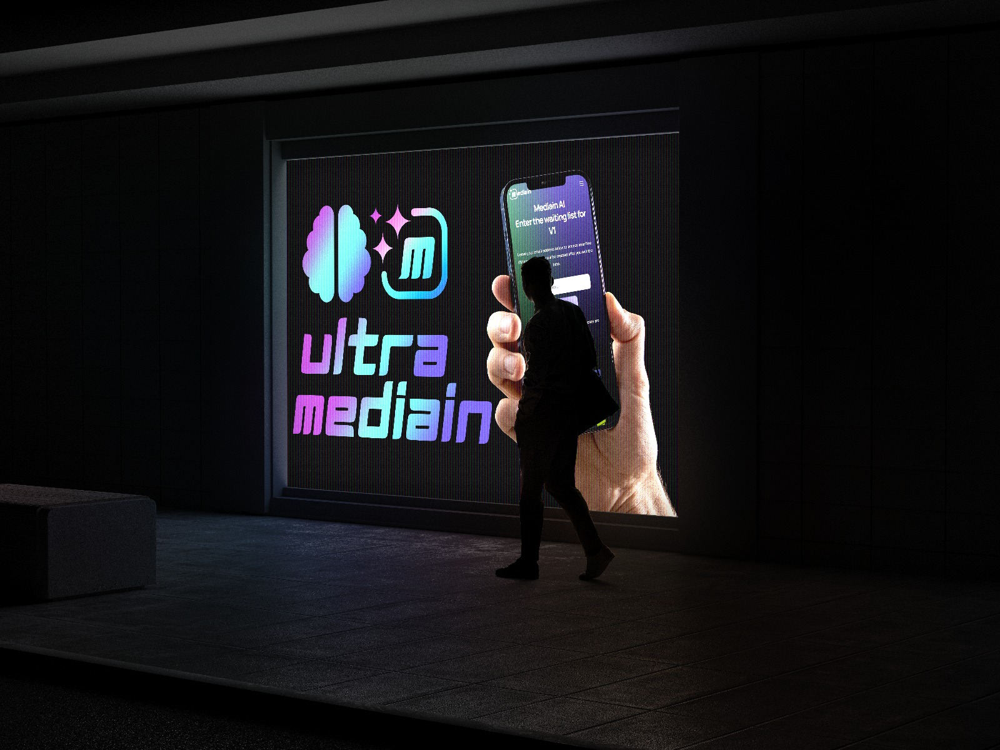

# Mediain AI - Medical Image Analysis Platform


Mediain AI is a comprehensive artificial intelligence platform designed for medical image analysis and diagnostic support. Our platform specializes in four critical medical areas with high-accuracy AI models.



## 🔬 AI Models & Capabilities


### 1. Pneumonia Detection
- **Accuracy**: 99.9%
- **Technology**: ResNet50 architecture
- **Input**: Chest MR images
- **Use Case**: Fast and reliable pneumonia diagnosis from medical imaging

### 2. Brain Tumor Detection
- **Accuracy**: 99.9%
- **Technology**: EfficientNet-B1 architecture
- **Input**: Brain MR images
- **Use Case**: Automated brain tumor detection and classification

### 3. Skin Cancer Classification
- **Accuracy**: 85%
- **Technology**: Advanced deep learning models
- **Input**: Microscopic skin images
- **Use Case**: Benign vs malignant lesion classification

### 4. Diabetic Retinopathy Assessment
- **Accuracy**: 86%
- **Technology**: EfficientNet-B4 architecture
- **Input**: Eye fundus photographs
- **Use Case**: Severity classification of diabetic retinopathy

## 🚀 Technical Specifications

- **GPU Support**: NVIDIA RTX 4000 Ada, RTX 6000 Ada, T4 GPU
- **Frameworks**: TensorFlow, Keras
- **Backend**: Python Flask
- **Processing Speed**: Real-time analysis (seconds to minutes)
- **Integration**: API-ready for healthcare systems

## 📋 Requirements

```
pip install -r requirements.txt
```

## 🏃‍♂️ Quick Start

1. Clone the repository
2. Install dependencies: `pip install -r requirements.txt`
3. Run the application: `python app.py`
4. Access the platform at `http://localhost:5000`

## 🎯 Use Cases

- **Clinical Decision Support**: Assist healthcare professionals in diagnostic processes
- **Medical Screening**: Rapid screening for common conditions
- **Research**: Medical image analysis for research purposes
- **Education**: Training tool for medical students and professionals

## 📊 Model Performance

Our AI models achieve exceptional accuracy rates suitable for clinical decision support systems:
- Pneumonia & Brain Tumor Detection: 99.9% accuracy
- Skin Cancer Classification: 85% accuracy  
- Diabetic Retinopathy: 86% accuracy

## ⚠️ Important Notice

These AI models are designed as clinical decision support tools to assist healthcare professionals. They are intended to complement, not replace, professional medical judgment and should always be used in conjunction with clinical expertise.

## 🎨 Credits

**Frontend Design & Development**: [efecreative.com](https://efecreative.com)
- Beautiful and modern UI/UX design
- Responsive web development
- User experience optimization

**AI Development & Backend**: Mediain AI Team
- Machine learning model development
- Backend infrastructure
- AI model training and optimization

## 📝 License

© 2025 All rights reserved.

## 🤝 Contributing

We welcome contributions to improve our AI models and platform. Please feel free to submit issues and enhancement requests.

## 📞 Contact

For more information about our AI diagnostic platform or integration opportunities, please contact us through our website.

---

*Mediain AI - Advancing healthcare through artificial intelligence* 
